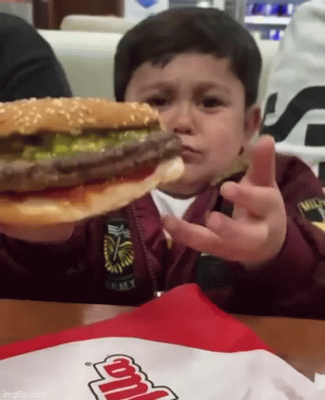

# BURGIR SPACE

## Indice

* [Burgir Space](#burgir-space)
* [Interfaz](#interfaz)
* [Prototipos](#prototipos)
* [Hisias de usuario](#historias-de-usuario)
* [Test de usabilidad](#test-de-usabilidad)

## Burgir Space 

Es una aplicación especialmente diseñada para **Tablets** con el fin de mejorar la experiencia en la toma de pedidos de restaurantes. Se compone por dos vistas mesero y cocinero donde cada trabajador puede identificarse para no mezclar pedidos, cuentas y recaudación de propinas si fuera el caso. 

## Interfaz 

*La orientación de la Tablet debe ser horizontal*

## Prototipos 

El nombre "Burgir" viene de un video viral y le dismos un concepto espacial. 

 

## Prototipo de baja 

 

## Prototipo de alta 

Puedes encontrar nuestro prototipo de alta en el siguiente enlace:

[Figma](https://www.figma.com/file/VegQAycyzVekEFLw07wWUD/Burgir-Space?node-id=97%3A72)

## Historias de Usuario

Hicimos 6 Historias de usuario en total para completar la vista del Mesero en la toma de pedidos:

Para ver las H.U en mejor calidad, visita este enlace:
https://miro.com/app/live-embed/o9J_lwqdxZY=/?moveToViewport=-4105,-6346,36415,16690

## Test de Usabilidad

Este es el testeo de el prototipo de alta:

